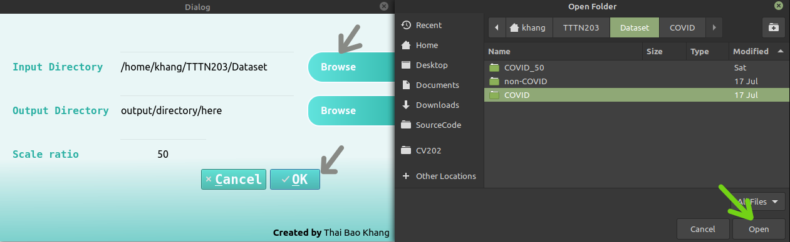
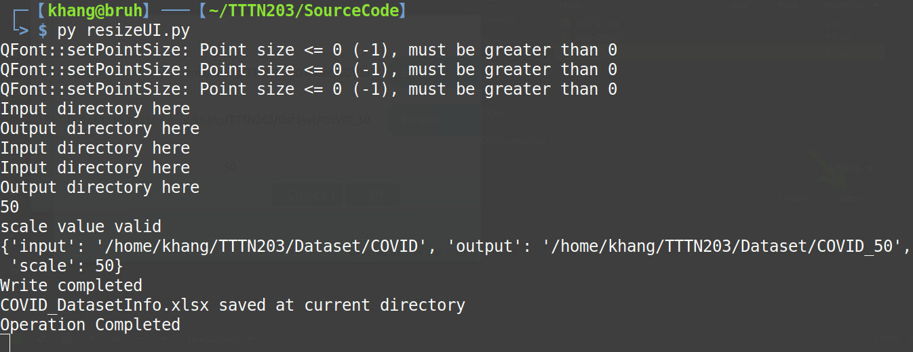

# Summer Intern Project Semester 203
### Thuc Tap Tot Nghiep He HK203

Medical Image Classification Desktop Application (COVID - Tuberculosis patient's CT/X-ray scan) </br>
Model created with tensorflow, custom trained on Google Colab GPU </br>
GUI made with PyQt5 </br>

#### 1. INSTALLING
1. Open your computer Terminal
2. Create virtual environment and activate it
3. Clone this repository
4. Install all dependencies
```bash
python -m venv new_venv
source new_venv/bin/activate
cd new_venv
git clone https://github.com/Minatozaki0911/summerIntern203.git 
pip install -r /summerIntern203/requirements.txt
```
#### 2. HOW TO USE
##### 1. Executable App
1. Run py setup.py install
2. Click on the new generated .exe file to start the application
3. Click on browse button to input source directory and output directory. Scale is resize percentage, default is 50. 
4. Click OK button to run, Cancel to exit. 

</img>

##### 2. Command Line Script
1. Activate virtual environment 
2. Run UI script, fill in required field.
3. Check terminal for inline debug. When complete there will be a new folder with all resized images and an Excel sheet contain metadata of input images.

```bash
source new_venv/bin/activate
cd new_venv/summerIntern203
python ResizeImage.py -i <YOUR/INPUT/DIRECTORY/PATH> -o <YOUR/INPUT/DIRECTORY/PATH> 
```

</img>

##### 3. Jupyter Notebook
My COVID_VGG16.ipynb file may already has my run history as well as hyperparameters, model parameters and architecture. <br>
Change test_path to your directory contain image you want to test. <br>
Ctrl F9 will run all codeblock. 


